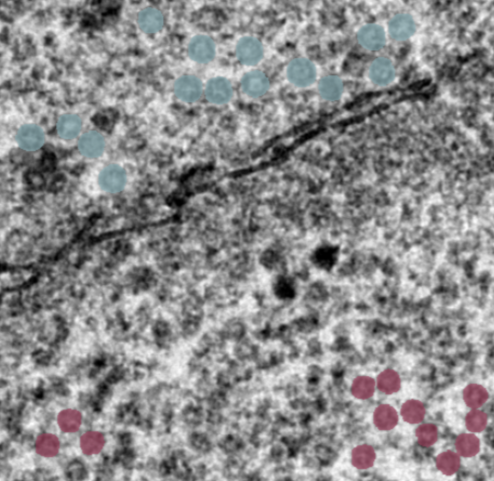

# EMcapsulins segmentation
Deep learning models to segment emcapsulins in 2D TEM micrograph images from the manuscript:

```
Genetically encoded barcodes for correlative volume electron microscopy
```




## Expected data
The models are trained on 8-bit images with a pixel size: of 0.5525 per nanometer.
We include some example input and output files for replication.

## Installation
0) optional, but recommended:
    create fresh cona environment
    conda create -n emcaps_env python=3.10
    conda activate emcaps_env


1) Clone this repository:
    ```bash
    git clone https://github.com/HelmholtzAI-Consultants-Munich/EMcapsulins_segmentation.git
    ```
2) Go into the repository and install:
    ```
    cd EMcapsulins_segmentation
    conda create -p ./napari_submission_env python=3.10
    pip install -r requirements.txt
    pip install -e .
    ```
    
## Usage

**run_batch_inference.py** <-- Example script for inference

**run_single_inference.py** <-- A script that provides a method for running the network on a single image

**training_script_headless.py** <-- Training the model form scratch.

'''python training_script_headless.py --data_folder example_data/example_outputs --model_folder test'''


Napari viewer for labels: 

1) Go into the napari folder

2) Start 'python napari_plugin_tif.py'

3) Select the directory with images on the right hand side

4) Scan directory: The program is looking at pairs of files ending with _mic.tif and _label.tif

5) Select image, load it and use the annotation tools to correct the mask

6) Save annotation (this updates the _label.tif file)


## Citation
when using the software please cite tba

```
tba
```

## Recommended Environment
* CUDA 11.4+
* Python 3.10+
* GPU with at least 4GB of VRAM

further details in requirements.txt

## Licensing

This project is licensed under the terms of the [GNU Affero General Public License v3.0](https://www.gnu.org/licenses/agpl-3.0.de.html).

Contact us regarding licensing.

## Contact / Feedback / Questions
If possible please open a GitHub issue [here](https://github.com/HelmholtzAI-Consultants-Munich/EMcapsulins_segmentation/issues).

For inquiries not suitable for GitHub issues:

felix.sigmund @ tum .de

gil.westmeyer @ tum .de
